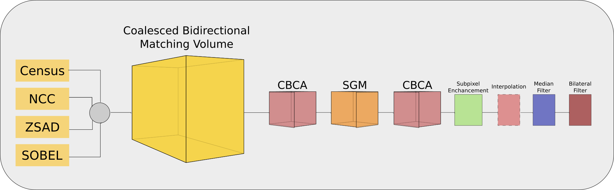

# Changjiang's Projects 
---

<!--Start List of Projects-->
<link rel="stylesheet" type="text/css" href="/css/proj.css">
<table cellspacing="1" cellpadding="3">

<!-- One project !!! -->
<!-- End of One project !!! -->

<!-- One project !!! -->
<tr>
<td >

</td>

<td class="style6" style="width: 700px"> 
<h4 class="style1"> A neural active reconstruction system with uncertainty learning for high-fidelity surface reconstruction: </h4>
<ul>
<li class="style1"> Ziyue Feng, Huangying Zhan, Zheng Chen, Qingan Yan, Xiangyu Xu, <strong>Changjiang Cai</strong>, Bing Li, Qilun Zhu, Yi Xu, &quot;<a href="https://arxiv.org/pdf/2402.18771" target="_blank" style="COLOR: #0000ee; TEXT-DECORATION: underline; text-underline: single"> 
NARUTO: Neural Active Reconstruction from Uncertain Target Observations   </a>
&quot;, 
	

in <em> IEEE Conf. on Computer Vision and Pattern Recognition (CVPR'2024) </em> , Seattle, US, Jun. 2024.

<a href="https://oppo-us-research.github.io/NARUTO-website/" target="_blank" style="COLOR: #0000ee; TEXT-DECORATION: underline; text-underline: single"> [Project Page]</a>, 
<a href="https://github.com/oppo-us-research/NARUTO" target="_blank" style="COLOR: #0000ee; TEXT-DECORATION: underline; text-underline: single"> [Code]</a>, 
<a href="https://www.youtube.com/watch?v=SsWdB-_5XM0" target="_blank" style="COLOR: #0000ee; TEXT-DECORATION: underline; text-underline: single"> [Video]</a>, 
<a href="https://github.com/oppo-us-research/NARUTO-website/blob/main/static/images/cvpr24_poster_naruto.png" target="_blank" style="COLOR: #0000ee; TEXT-DECORATION: underline; text-underline: single"> [Poster]</a>.
</li>

</ul>
</td>
</tr>
<!-- End of One project !!! -->

<!-- One project !!! -->
<tr>
<td >

</td>

<td class="style6" style="width: 700px"> 
<h4 class="style1"> A “Learning-to-optimize” Paradigm for MVS Depth Estimation: </h4>
<ul>
<li class="style1"> <strong>Changjiang Cai</strong>, Pan Ji, Qingan Yan, Yi Xu, &quot;<a href="https://arxiv.org/pdf/2205.14320.pdf" target="_blank" style="COLOR: #0000ee; TEXT-DECORATION: underline; text-underline: single"> 
RIAV-MVS: Recurrent-Indexing an Asymmetric Volume for Multi-View Stereo   </a>
&quot;, 
	

in <em> IEEE Conf. on Computer Vision and Pattern Recognition (CVPR'2023) </em> , Vancouver, Canada, Jun. 2023.

<a href="http://www.changjiangcai.com/riav-mvs.github.io/" target="_blank" style="COLOR: #0000ee; TEXT-DECORATION: underline; text-underline: single"> [Project Page]</a>, 
<a href="https://github.com/oppo-us-research/riav-mvs" target="_blank" style="COLOR: #0000ee; TEXT-DECORATION: underline; text-underline: single"> [Code]</a>, 
<a href="https://www.youtube.com/watch?v=7nvtlz0Caso" target="_blank" style="COLOR: #0000ee; TEXT-DECORATION: underline; text-underline: single"> [Video]</a>, 
<a href="files/riavmvs-cvpr2023/cvpr23_poster_RIAV-MVS.pdf" target="_blank" style="COLOR: #0000ee; TEXT-DECORATION: underline; text-underline: single"> [Poster]</a>,
<a href="files/riavmvs-cvpr2023/RIAV-MVS-Slides-CVPR2023.pdf" target="_blank" style="COLOR: #0000ee; TEXT-DECORATION: underline; text-underline: single"> [Slides]</a>.
</li>

</ul>
</td>
</tr>
<!-- End of One project !!! -->

<!-- One project !!! -->
<tr>
<td style="width: 550px">

</td>

<td class="style6" style="width: 612px"> 
<h4 class="style1"> Plane Reconsturction from MVS:</h4>
<ul>
<li class="style1"> Jiachen Liu, Pan Ji, Nitin Bansal, <strong>Changjiang Cai</strong>, Qingan Yan, Xiaolei Huang, Yi Xu, &quot;<a href="https://arxiv.org/pdf/2203.12082.pdf" target="_blank" style="COLOR: #0000ee; TEXT-DECORATION: underline; text-underline: single"> 
  PlaneMVS: 3D Plane Reconstruction from Multi-View Stere </a>
&quot;, 
	

in <em> IEEE Conf. on Computer Vision and Pattern Recognition (CVPR'2022) </em> , New Orleans, USA, Jun. 2022.

<a href="https://oppo-us-research.github.io/PlaneMVS/" target="_blank" style="COLOR: #0000ee; TEXT-DECORATION: underline; text-underline: single"> [Project Page]</a>, 
<a href="https://github.com/oppo-us-research/PlaneMVS" target="_blank" style="COLOR: #0000ee; TEXT-DECORATION: underline; text-underline: single"> [Code]</a>, 
<a href="https://www.youtube.com/watch?v=yPoWc79XYsQ" target="_blank" style="COLOR: #0000ee; TEXT-DECORATION: underline; text-underline: single"> [Video]</a>, 
<a href="files/planemvs-cvpr2022/planemvs-poster.pdf" target="_blank" style="COLOR: #0000ee; TEXT-DECORATION: underline; text-underline: single"> [Poster]</a>,
<a href="https://oppo-us-research.github.io/PlaneMVS/static/images/cvpr22_slide_PlaneMVS.pdf" target="_blank" style="COLOR: #0000ee; TEXT-DECORATION: underline; text-underline: single"> [Slide]</a>.

</li>

</ul>
</td>
</tr>
<!-- End of One project !!! -->

<!-- One project !!! -->
<tr>
<td style="width: 550px">

<!-- img alt=" msnet" src="files/dafstereonet-3dv2020/2D-3D-deep-stereo-nets.png" width="515" --> 
</td>

<td class="style6" style="width: 612px"> 
<h4 class="style1"> Deep Adaptive Filtering Stereo Networks (DAF-Nets):</h4>
<ul>
<li class="style1"> <strong>Changjiang Cai</strong>, Philippos Mordohai, &quot;<a href="https://arxiv.org/pdf/2010.07350.pdf" target="_blank" style="COLOR: #0000ee; TEXT-DECORATION: underline; text-underline: single"> 
  Do End-to-end Stereo Algorithms Under-utilize Information? </a>
&quot;, 
	

in <em>  International Conference on 3D Vision (3DV'2020) </em> , Fukuoka, Japan, Nov. 2020.

<a href="https://github.com/ccj5351/DAFStereoNets" target="_blank" style="COLOR: #0000ee; TEXT-DECORATION: underline; text-underline: single"> [Code]</a>, 
<a href="https://youtu.be/jarA_fj9z18" target="_blank" style="COLOR: #0000ee; TEXT-DECORATION: underline; text-underline: single"> [Video]</a>, 
<a href="files/dafstereonet-3dv2020/poster-daf.pdf" target="_blank" style="COLOR: #0000ee; TEXT-DECORATION: underline; text-underline: single"> [Poster]</a>,
<a href="files/dafstereonet-3dv2020/daf-stereo-10mins-final.pdf" target="_blank" style="COLOR: #0000ee; TEXT-DECORATION: underline; text-underline: single"> [Slides]</a>.

</li>

</ul>
</td>
</tr>
<!-- End of One project !!! -->

<!-- One project !!! -->
<tr>
<td style="width: 550px">

</td>

<td class="style6" style="width: 612px"> 
<h4 class="style1"> Domain-invariant Matching-space Stereo Networks (MS-Nets):</h4>
<ul>
<li class="style1"> <strong>Changjiang Cai</strong>, Matteo Poggi, Stefano Mattoccia, Philippos Mordohai, &quot;<a href="https://arxiv.org/pdf/2010.07347.pdf" target="_blank" style="COLOR: #0000ee; TEXT-DECORATION: underline; text-underline: single"> 
  Matching-space Stereo Networks for Cross-domain Generalization </a>
&quot;, 
	

in <em>  International Conference on 3D Vision (3DV'2020) </em> , Fukuoka, Japan, Nov. 2020.

<a href="https://github.com/ccj5351/MS-Nets" target="_blank" style="COLOR: #0000ee; TEXT-DECORATION: underline; text-underline: single"> [Code]</a>, 
<a href="https://youtu.be/j2QFDix0_fM" target="_blank" style="COLOR: #0000ee; TEXT-DECORATION: underline; text-underline: single"> [Video]</a>, 
<a href="files/msnet-3dv2020/poster-msnet.pdf" target="_blank" style="COLOR: #0000ee; TEXT-DECORATION: underline; text-underline: single"> [Poster]</a>,
<a href="files/msnet-3dv2020/msnet-10mins-final.pdf" target="_blank" style="COLOR: #0000ee; TEXT-DECORATION: underline; text-underline: single"> [Slides]</a>,
<a href="https://youtu.be/Qr6WGsPX5P8" target="_blank" style="COLOR: #0000ee; TEXT-DECORATION: underline; text-underline: single"> [Supp-video-MSGCNet]</a>,
<a href="https://youtu.be/t9WPc3pxzc4" target="_blank" style="COLOR: #0000ee; TEXT-DECORATION: underline; text-underline: single"> [Supp-video-MSPSMNet]</a>.

</li>

</ul>
</td>
</tr>
<!-- End of One project !!! -->

<!-- One project !!! -->
<tr>
<td style="width: 550px">

</td>

<td class="style6" style="width: 612px"> 
<h4 class="style1"> RGB-D Human Mesh Recovery:</h4>
<ul>
<li class="style1"> Ren Li, <strong>Changjiang Cai</strong>, Georgios Georgakis, Srikrishna Karanam, Terrence Chen, Ziyan Wu, &quot; <a href="https://arxiv.org/pdf/1911.07383v1.pdf" target="_blank" style="COLOR: #0000ee; TEXT-DECORATION: underline; text-underline: single"> Towards Robust RGB-D Human Mesh Recovery </a> 
&quot;,
  
arXiv:1911.07383  
</li>

</ul>
</td>
</tr>
<!-- End of One project !!! -->

<!-- One project !!! -->
<tr>
<td style="width: 550px">

</td>

<td class="style6" style="width: 612px"> 
<h4 class="style1"> Cost Volume for Disparity Estimation:</h4>
<ul>
<li class="style1"> Konstantinos Batsos, <strong>Changjiang Cai</strong>, Philippos Mordohai, &quot;<a href="files/cvpr-cbmv-2019/Batsos_CBMV_A_Coalesced_CVPR_2018_paper.pdf" target="_blank" style="COLOR: #0000ee; TEXT-DECORATION: underline; text-underline: single"> CBMV: A Coalesced Bidirectional Matching Volume for Disparity Estimation</a>
&quot;, 
	

in Proc. <em>IEEE Conf. on Computer Vision and Pattern Recognition (CVPR'2018)</em> , Salt Lake City, Utah, USA, June 2018.

<a href="https://github.com/kbatsos/CBMV/tree/master" target="_blank" style="COLOR: #0000ee; TEXT-DECORATION: underline; text-underline: single"> [Code]</a>, 

<a href="files/cvpr-cbmv-2019/supplement.pdf" target="_blank" style="COLOR: #0000ee; TEXT-DECORATION: underline; text-underline: single"> [Supp]</a>,

<a href="files/cvpr-cbmv-2019/CBMV.mp4" target="_blank" style="COLOR: #0000ee; TEXT-DECORATION: underline; text-underline: single"> [Video]</a>,

<a href="files/documents/cbmv_poster_cvpr2018.pdf" target="_blank" style="COLOR: #0000ee; TEXT-DECORATION: underline; text-underline: single"> [Poster]</a>.

</li>

</ul>
</td>
</tr>
<!-- End of One project !!! -->

<!-- One project !!! Crowdsourcing: Budget-conscious Ranking by Non-interactive Crowdsourcing -->
<tr>
<td style="width: 550px">

</td>

<td class="style6" style="width: 612px"> 
<h4 class="style1"> Pairwise Ranking Aggregation by Non-interactive Crowdsourcing with Budget Constraints:</h4>
<ul>
<li class="style1"> <strong>Changjiang Cai</strong>, Haipei Sun, Boxiang Dong, Bo Zhang, Ting Wang, Hui Wang, &quot;<a href="files/crowdsourcing/ICDCS17.pdf" target="_blank" style="COLOR: #0000ee; TEXT-DECORATION: underline; text-underline: single"> Pairwise Ranking Aggregation by Non-interactive Crowdsourcing with Budget Constraints</a>
&quot;, 
	 
    in the 37th <em> IEEE International Conference on Distributed Computing (ICDCS'2017)</em> , Atlanta, GA, USA, June 2017.

<a href="https://github.com/ccj5351/crowdsourcing" target="_blank" style="COLOR: #0000ee; TEXT-DECORATION: underline; text-underline: single"> [Code]</a>,

<a href="files/crowdsourcing/ICDCS17-long.pdf" target="_blank" style="COLOR: #0000ee; TEXT-DECORATION: underline; text-underline: single"> [LongPaper]</a>.

</li>
</ul>
</td>
</tr>

<!-- End of One project !!! -->

<!-- One project !!! Epitome!!! -->
<tr>
<td style="width: 550px">

 

</td>

<td class="style6" style="width: 612px"> 
<h4 class="style1"> Epitome Transform Coding: Towards Joint Compression of Images:</h4>
<ul>
<li class="style1"> <strong>Changjiang Cai</strong>, directed by Prof. Gang Hua, at Stevens Institute of Technology (SIT), NJ, US, &quot;<a href="files/epitome/report.pdf" target="_blank" style="COLOR: #0000ee; TEXT-DECORATION: underline; text-underline: single"> Master Thesis Project</a>
&quot;,

<a href="https://github.com/ccj5351/epitome_coding" target="_blank" style="COLOR: #0000ee; TEXT-DECORATION: underline; text-underline: single"> [Code]</a>, 

<a href="files/epitome/slide.pdf" target="_blank" style="COLOR: #0000ee; TEXT-DECORATION: underline; text-underline: single"> [Slide]</a>.

</li>
</ul>
</td>
</tr>
<!-- End of One project !!! -->

<!-- One project !!! Design and 3D Modeling of an Assistive Robot!!! -->
<tr>
<td style="width: 550px">

 

</td>

<td class="style6" style="width: 612px"> 
<h4 class="style1"> Design and 3D Modeling of an Assistive Robot:</h4>
<ul>
<li class="style1"> <strong>Changjiang Cai</strong>, directed by Prof. Renping Shao, at Northwestern Polytechnical University (NWPU), Xi'an, China, &quot;<a href="files/assistive-robot/Design-and-3D-Modeling-of-an-Assistive-Robot.pdf" target="_blank" style="COLOR: #0000ee; TEXT-DECORATION: underline; text-underline: single"> Bachelor Thesis Project</a>
&quot;.

</li>
</ul>
</td>
</tr>
<!-- End of One project !!! -->

</table>
<!--End List of Projects-->
